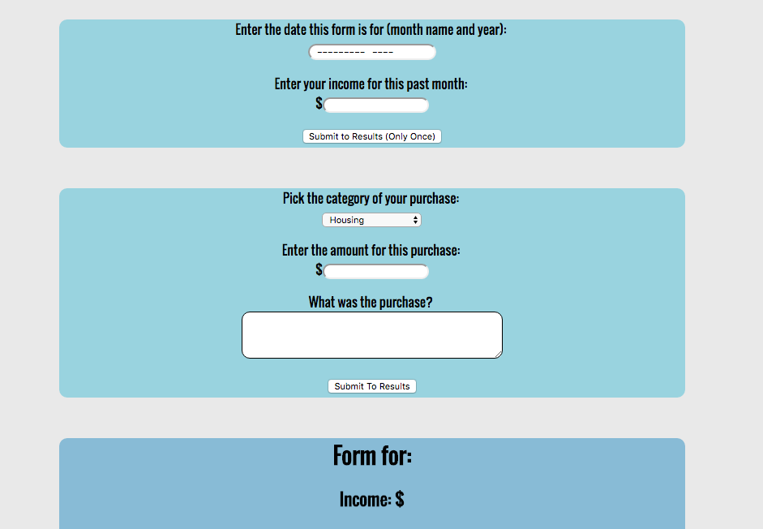
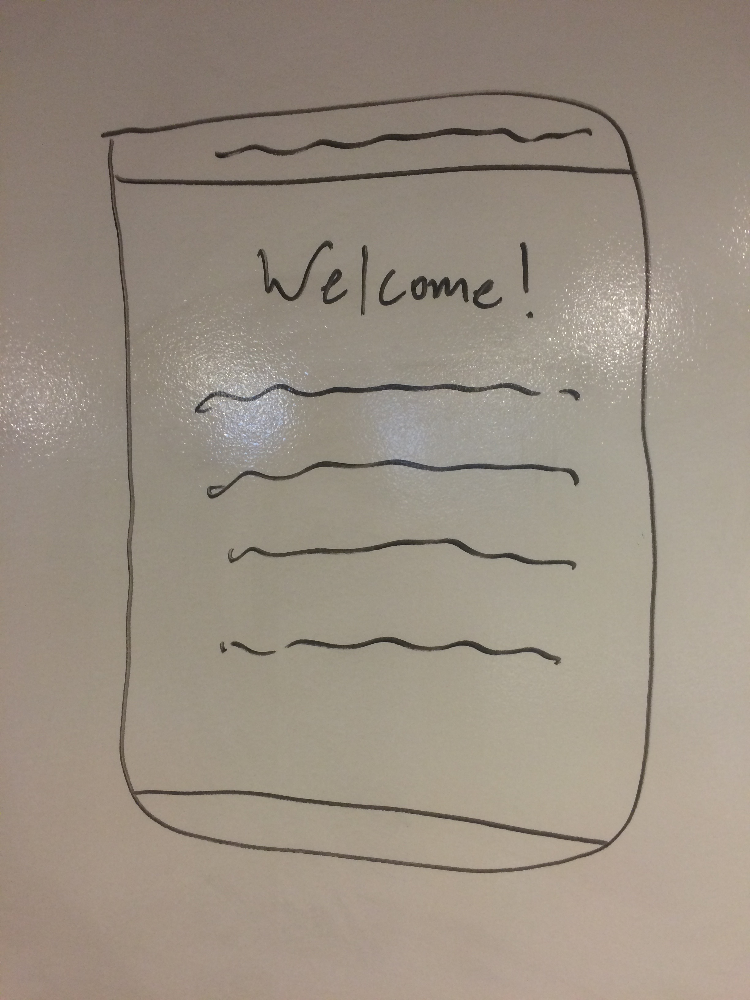
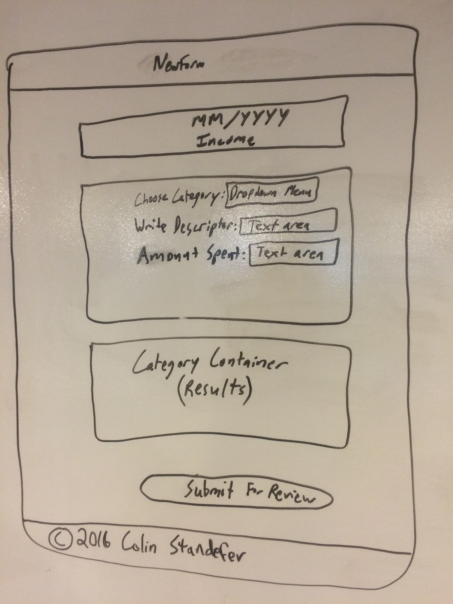

# Xpndbl

#The App

This app allows users to track their income and expenses each month. Users may login to post new forms as well as view past forms.

#Technologies Used

React, Node.js, Express.js, mLab(MongoDB), CSS

I used React to create the majority of the front end.  

I used MEN (MongoDB, Express, Node) to create a back end, a database, and to save to and route to and from and

CSS was used for styling.

#Approach Taken

Before I began coding, I did the following: 1. Brainstorming and choosing a project idea, 2. User Stories, 3. Wireframes, 4. Mapped out Components, 5. Potential Bonus Features, 6. Decided what needed to happen and in what order

#User Stories

User comes to site and reads landing page
User signs up and/or logs in
User clicks New Form
User enters their information into form
User sees their information move to list
User submits information
User can view submitted information 

#Installation Instructions

Clone the repository to your local machine
Run npm install inside the directory to install all the dependecies used in this project.
Once the dependecies are installed, you can run nodemon in terminal and webpack --watch and visit localhost:3000 to view the web app locally.

#Unsolved Problems

We had several bonus features we were unable to resolve or ran into a time crunch on.

Proper centering of the nav (CSS)
Proper formatting of the results (CSS)

#Future Features

Sum of Expenses
Remainder-Container
Remainder
Remainder-Choice
Method of Purchase
Cease & Desist Checkbox
Edit Expenses
Delete Expenses
Goals for Next Month
Non-Repeater Multiplier
Modal Preview Upon Submit
Modal Confirmation Prior To Save
Running Total of Debt, Savings, and Investments
Income vs. Savings vs. Investments vs. Debt Line Graph
Cease & Desist Reminder via Communication Between Past & New Forms
